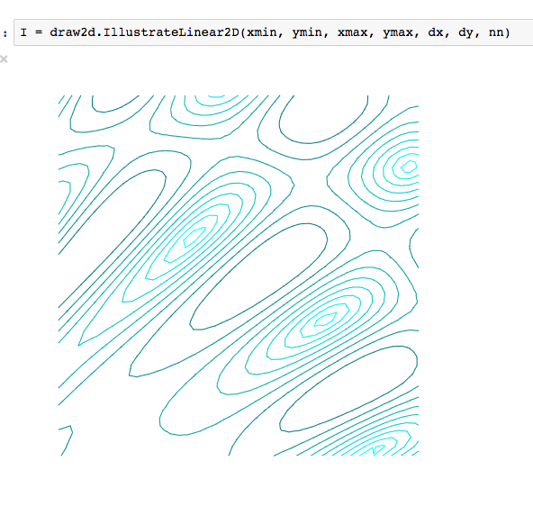
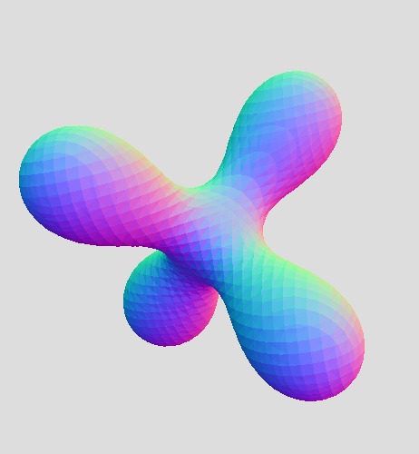

# contourist

Data structures, algorithms and display tools for generating 2d contours
and 3d isosurfaces.

# Contour interpolations

[Contour lines](https://en.wikipedia.org/wiki/Contour_line) define
a boundary as a sequence of linesegments approximating f(x,y) = v
for some function f, some value v and x and y varying in some specified region.

# Isosurfaces

[Isosurfaces](https://en.wikipedia.org/wiki/Isosurface) define
a boundary as a collection of oriented triangles approximating f(x,y,z) = v
for some function f, some value v and (x,y,z) varying in some specified volume.

Here is a live jsfiddle demo of an isosurface displayed using jsfiddle:
[https://jsfiddle.net/AaronWatters/9qszgyaj/](https://jsfiddle.net/AaronWatters/9qszgyaj/).

